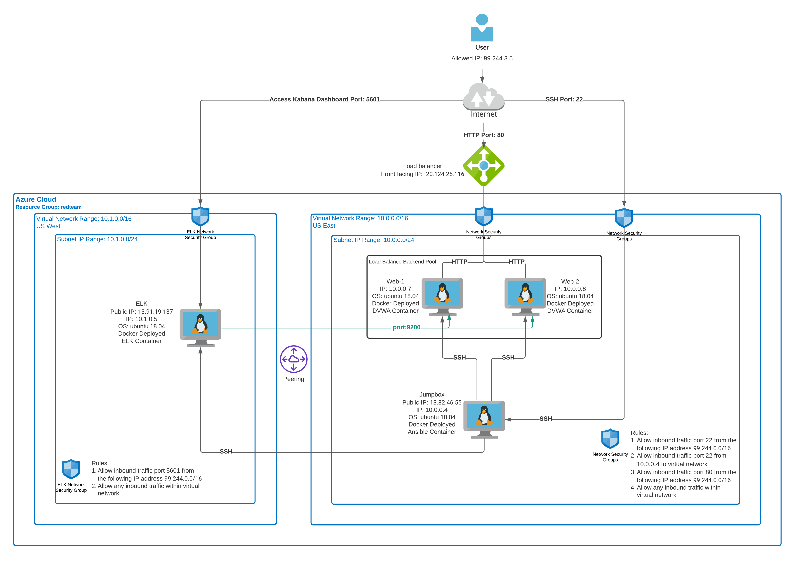

## Automated ELK Stack Deployment

The files in this repository were used to configure the network depicted below.



These files have been tested and used to generate a live ELK deployment on Azure. They can be used to either recreate the entire deployment pictured above. Alternatively, select portions of the my-playbook-elk.yml file may be used to install only certain pieces of it, such as Filebeat.

  - my-playbook-dvwa.yml
  - my-playbook-elk.yml

This document contains the following details:
- Description of the Topologu
- Access Policies
- ELK Configuration
  - Beats in Use
  - Machines Being Monitored
- How to Use the Ansible Build


### Description of the Topology

The main purpose of this network is to expose a load-balanced and monitored instance of DVWA, the D*mn Vulnerable Web Application.

Load balancing ensures that the application will be highly available, in addition to restricting bottleneck to the network.
- _TODO: What aspect of security do load balancers protect? What is the advantage of a jump box?_

Integrating an ELK server allows users to easily monitor the vulnerable VMs for changes to the operating system metrics such as CPU or memory or data related to services running on the server and system network.

The configuration details of each machine may be found below.
_Note: Use the [Markdown Table Generator](http://www.tablesgenerator.com/markdown_tables) to add/remove values from the table_.

| Name     | Function | IP Address | Operating System |
|----------|----------|------------|------------------|
| Jumpbox | Gateway  | 10.0.0.4   | Linux            |
| Web-1     | Web Servers          | 10.0.0.7           | Linux                  |
| Web-2     | Web Servers         | 10.0.0.8           | Linux                 |
| ELK     | Elastic Search and Kabana          | 10.1.0.5            | Linux                  |

### Access Policies

The machines on the internal network are not exposed to the public Internet. 

Only the Jumpbox machine can accept connections from the Internet. Access to this machine is only allowed from the following IP addresses:
- 99.244.0.0/16

Machines within the network can only be accessed by SSH.
- _TODO: Which machine did you allow to access your ELK VM? What was its IP address?_

A summary of the access policies in place can be found in the table below.

| Name     | Publicly Accessible | Allowed IP Addresses |
|----------|---------------------|----------------------|
| Jumpbox | Yes              | 10.0.0.7, 10.0.0.8, 10.1.0.5, 99.244.3.5    |
| ELK         | Yes                    | 10.0.0.7, 10.0.0.8, 99.244.3.5                    |
|          |                     |                      |

### Elk Configuration

Ansible was used to automate configuration of the ELK machine. No configuration was performed manually, which is advantageous because it reduces human errors when performing software deployment and configurations.  As well it reduces the total amount of time to complete these tasks. 

The playbook implements the following tasks:
- Install Docker
- Increase virtual memory
- Download and launch ELK docker container
- Enable Docker service on boot
- Install and configure filebeat and metricbeat 

The following screenshot displays the result of running `docker ps` after successfully configuring the ELK instance.


### Target Machines & Beats
This ELK server is configured to monitor the following machines:
- Web-1 (10.0.0.7)
- Web-2 (10.0.0.8)

We have installed the following Beats on these machines:
- Filebeat
- Metricbeat

These Beats allow us to collect the following information from each machine:
- Filebeat is often used to collect log files from very specific files, such as logs generated by Apache, Microsoft Azure tools, the Nginx web server, or MySQL databases. Filebeat to monitor the Apache server and MySQL database logs generated by DVWA.
- Metricbeat is used to collect metrics from the operating system and from services running on the server.  Metricbeat will be able to tell us how each web servers are performing relates to CPU, memory and disk I/O.

### Using the Playbook
In order to use the playbook, you will need to have an Ansible control node already configured. Assuming you have such a control node provisioned: 

SSH into the control node and follow the steps below:
- Copy the __my-playbook-elk.yml__ file to __/etc/ansible__.
  ```
  curl -o /etc/ansible/my-playbook-elk.yml https://raw.githubusercontent.com/nelsonning/cybersecurity/main/Ansible/my-playbook-elk.yml
  ```
- Copy the __filebeat-config.yml__ and __metricbeat-config.yml__ file to __/etc/ansible/files__.
  ```
  curl -o /etc/ansible/files/filebeat-config.yml https://raw.githubusercontent.com/nelsonning/cybersecurity/main/Ansible/filebeat-config.yml
  ```
  ```
  curl -o /etc/ansible/files/metricbeat-config.yml https://raw.githubusercontent.com/nelsonning/cybersecurity/main/Ansible/metricbeat-config.yml
  ```
- Update the __hosts__ file 
  ```
  nano /etc/ansible/hosts
  ```
  to include the following:
  ```
  [webservers]
  10.0.0.7 ansible_python_interpreter=/usr/bin/python3
  10.0.0.8 ansible_python_interpreter=/usr/bin/python3
  [elk]
  10.1.0.5 ansible_python_interpreter=/usr/bin/python3
  ```
- Run the playbook
  ```
  ansible-playbook /etc/ansible/my-playbook-elk.yml
  ```
- Navigate to __http://13.91.19.137:5601/app/kibana#/home__ to check that the installation worked as expected.


